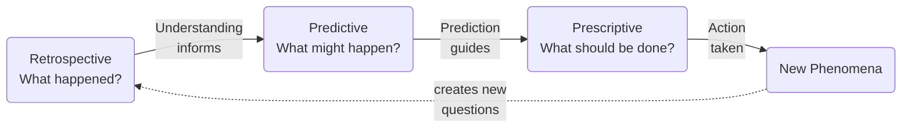
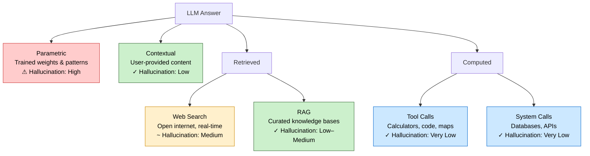
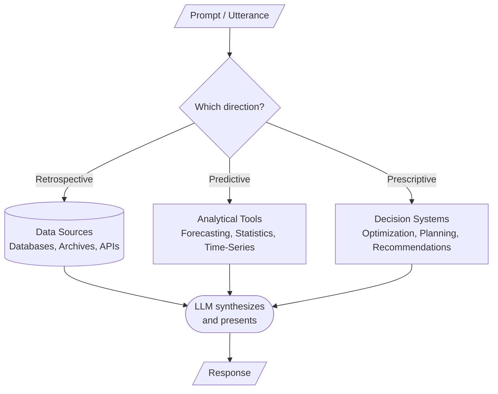
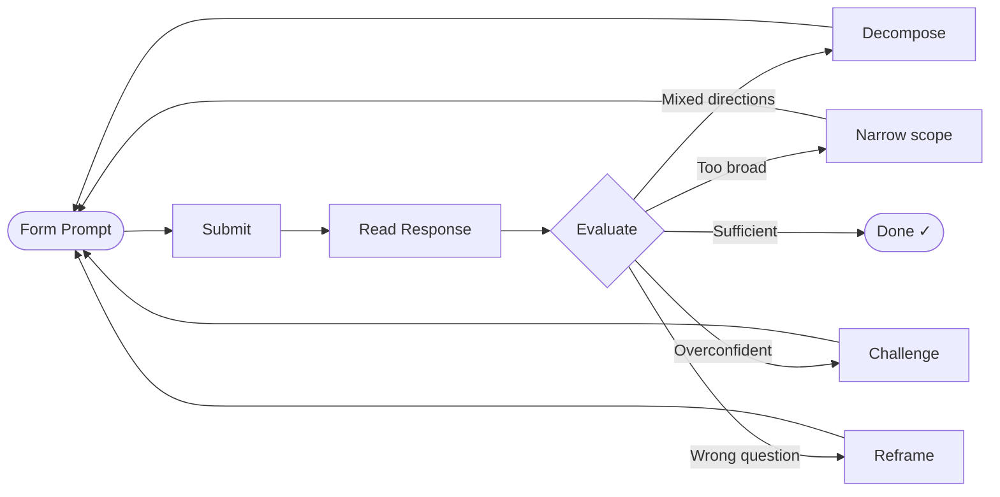

# How to Ask Large Language Models: A Philosophical Inquiry from Knowledge and Judgment to Responsibility

A teaching guide exploring the principles of effective prompting—and what it reveals about how we think.

---

## Contents

1. [Why We Use Large Language Models](#why-we-use-large-language-models)
2. [Why We Must Relearn How to Ask](#why-we-must-relearn-how-to-ask)
3. [The Three Fundamental Directions](#the-three-fundamental-directions)
4. [What a Large Language Model Is Actually Doing](#what-a-large-language-model-is-actually-doing)
5. [Questions Are Not Neutral](#questions-are-not-neutral)
6. [What Makes a Good Prompt](#what-makes-a-good-prompt)
7. [Language Quality: Grammar, Semantics, and Representation](#language-quality-grammar-semantics-and-representation)
8. [Hallucination: A Shared Problem](#hallucination-a-shared-problem)
9. [Responsible Use](#responsible-use)
10. [Domain Tools and the Routing Dimension](#domain-tools-and-the-routing-dimension)
11. [Prompting as Iteration](#prompting-as-iteration)
12. [Real-World Examples](#real-world-examples)
13. [Conclusion: Asking a Model Trains You](#conclusion-asking-a-model-trains-you)

---

## Why We Use Large Language Models

We use large language models because they can **understand and generate natural language**—dramatically lowering the barrier between humans and computers. Traditional software requires structured input and predefined workflows. A language model accepts the ambiguity and complexity of everyday human expression and works with it directly.

This makes LLMs useful for a wide range of tasks: information retrieval, content generation, knowledge summarization, and decision support. They can also integrate information scattered across disparate sources and present it in coherent, readable form.

When combined with external tools and domain-specific systems, LLMs go further still. They can not only *answer questions* but *complete tasks*—becoming a **universal interface that connects human intent to complex systems**. The prompt, in this context, is not just a search query. It is an instruction to an intelligent agent capable of reasoning, routing, and acting on your behalf.

This is what makes the quality of your prompts matter so much: the interface is expressive enough to handle almost anything you can say, but that expressiveness also means that what you say—and how you say it—shapes everything that follows.

---

## Why We Must Relearn How to Ask

Today, more and more people are turning to large language models as work assistants, learning companions, even a kind of "super brain." They ask it to help understand the news, analyze economies, revisit history, organize ideas, generate text, and offer advice. A question emerges that looks deceptively simple: **How, exactly, should we ask?**

On the surface, this seems like a Prompt Engineering problem—can we just write better, more detailed, more "professional" prompts? But on closer reflection, it is not only technical. **It is first a question of language, then a question of knowledge, and finally a question of responsibility.**

### Prompting as a Projection of Thought

When a person asks a question to a language model, they are not merely inputting a string of words. They are **entrusting the system with their intentions, assumptions, standpoints, knowledge boundaries, and cognitive habits all at once**. A prompt, on the surface, is a sentence—but at a deeper level, it is a projection of a way of thinking. How we ask does not only determine how the machine responds; it determines how we ourselves will come to understand the world.

Language models thus become mirrors. They reflect not the reality we're asking about, but the quality of our own inquiry. This is why learning to prompt well is not optional refinement—it is an act of intellectual discipline that sharpens how we understand anything, with or without AI.

---

## The Three Fundamental Directions

### The Universal Logic of Human Inquiry

Human inquiry about complex systems follows a universal logic that transcends domain boundaries. Whether investigating a patient's condition, a machine's failure, or a market's behavior, humans ask the same fundamental questions in the same sequence.

These three categories are not arbitrary divisions. They reflect the natural progression of how knowledge accumulates and how wisdom unfolds:

1. **Understanding** precedes **prediction**
2. **Prediction** informs **action**
3. **Action** creates new phenomena to understand

Together, they form a cycle of knowledge, reflection, and intervention—the rhythm through which human engagement with any complex system deepens over time.

This tripartite structure echoes something Aristotle recognized long before AI existed: that human knowing takes irreducibly different forms. *Episteme*—theoretical or scientific knowledge—is concerned with what is and why; it is the knowledge that holds universally and can be demonstrated. *Phronesis*—practical wisdom—is the capacity to discern what ought to be done in particular circumstances, weighing values and constraints that no formula can fully capture. The progression from retrospective inquiry through prediction to prescriptive judgment is, in miniature, the movement from episteme toward phronesis.

Hans-Georg Gadamer described understanding as a *hermeneutic circle*: we cannot grasp the whole without engaging the parts, and we cannot read the parts without some anticipation of the whole. The interpreter's horizon—shaped by prior understanding, culture, and experience—is never absent from the act of inquiry. The knowledge cycle below is the hermeneutic circle in practical form: each act of understanding shifts our horizon, opening new questions that could not have been articulated before.

Good prompting is not about stacking more words. It is about knowing **what type of question you are actually asking**, and which phase of this cycle you are in.

### Direction 1: Retrospective (What Has Happened)

*What information is relatively stable and verifiable? What actually happened? What do we already know?*

The retrospective lens is about **establishing ground truth**. Before we can predict the future or prescribe action, we must understand what we know about the present and past. This is the foundation of all reasoning—the empirical bedrock upon which confidence is built. Retrospective questions ask: "What does the evidence tell us?" They are acts of epistemological humility: acknowledging what we can verify and distinguishing it from what we must infer.

### Direction 2: Predictive (What Might Happen)

*If conditions continue, what different outcomes might emerge? What patterns can we project forward?*

The predictive lens extends knowledge into the future through **informed inference**. Prediction is not about achieving certainty—it is about quantifying uncertainty and identifying trajectories. It reflects the human desire to anticipate, to prepare, to shift from reactive to proactive. Predictive questions acknowledge that the future is shaped by patterns already observed; they are acts of pattern recognition extended through time.

### Direction 3: Normative / Prescriptive (What Should Be Done)

*Given different goals and constraints, what should be done? What actions would be optimal?*

The prescriptive lens is about **translating knowledge into will**. It is where understanding meets responsibility. Prescriptive questions do not merely ask what is true or what will happen—they ask what *should* happen given our values, constraints, and goals. This is the realm of decision, judgment, and agency. These questions acknowledge that multiple futures are possible, and our choices shape which one unfolds.

Hume's insight applies here with full force: the prescriptive is irreducibly normative. No model, however capable, can derive what you *should* do from facts alone without value premises that only you can supply. When a model offers recommendations, it is—knowingly or not—importing value assumptions. Your task is to make those assumptions visible and judge whether they are yours.

### Why Separation Matters

Many people write prompts by stuffing in everything at once—facts, opinions, predictions, and recommendations all tangled together. Length is not the problem. **Mixing directions is the problem.**

For example, the temptation is to ask:

> "Tell me whether this policy is good or bad, whether it will fail, and whether the media is biased—and explain it all."

This conflates retrospective facts, explanatory analysis, predictive reasoning, and value judgments. Better to separate:

1. **Retrospective**: What are the main contents of this policy?
2. **Explanatory**: What are the core arguments from supporters and critics?
3. **Predictive**: What different outcomes might emerge short-term and long-term?
4. **Normative**: Under what value standard would someone consider it a success or failure?

**The discipline is to separate them**—not because the model requires it, but because *you* require it to think clearly.

---

## What a Large Language Model Is Actually Doing

Language models appear to answer questions, but not because they directly perceive reality or inherently possess truth.

Their core mechanism: **learn statistical patterns from text, then predict what is most likely to come next.**

They are fundamentally **probabilistic language prediction systems**—and only secondarily do they appear to understand, explain, reason, or create.

This means:
- An answer from a model is often a high-probability output in language space
- It may be useful, fluent, and close to reality
- But it is not identical with reality itself

### Why This Distinction Matters

This is not a technical caveat to mention and move past. It is the foundation of responsible engagement with these systems. A language model operates in the realm of **what is expressible, coherent, and typical**—not the realm of **what is true**. These overlap but are not identical.

Understanding this gap is crucial because it protects you from a subtle form of intellectual danger: accepting answers precisely *because* they sound plausible. The more fluent a model's output, the more critical your scrutiny must be.

### Where Answers Come From

This is one of the most important questions to ask when working with language models. LLM answers can draw from four distinct sources—each with different reliability, timeliness, and hallucination risk.

**Parametric — the model's internally learned knowledge and language patterns.**
During training, the model is exposed to vast amounts of text and compresses patterns, associations, and common expressions into its parameters. When you ask a question, it predicts the most reasonable continuation based on context.

*Hallucination risk: **High.*** The model generates from statistical probability, not verified fact. It may confidently produce incorrect names, dates, citations, or statistics—especially near its knowledge cutoff, for niche topics, or when asked for precise figures. This is the highest-risk source because there is no external ground truth to constrain the output. *An LLM relying solely on parametric knowledge has the highest likelihood of hallucination.*

**Contextual — information you supply directly in the prompt.**
Documents, data, examples, or facts pasted into the prompt itself. You know their provenance, recency, and accuracy—and the model has them directly in its context window.

*Hallucination risk: **Low.*** The model can be anchored to the provided content. It may still misread, selectively quote, or add details not present in the material—but grounded prompting significantly reduces fabrication. *This is why providing your own sources is one of the most effective defenses against hallucination.*

**Retrieved — information fetched from external sources.**

- *Web search* — searches the open internet for up-to-date information. Well-suited for real-time questions: current news, prices, recent policy changes.

  *Hallucination risk: **Medium.*** Retrieved content anchors the response, but the model may misquote, misattribute, or blend sources. The internet itself contains inaccurate or biased content. *Without web search, LLM alone has very high risk for any post-cutoff or real-time information.*

- *RAG (Retrieval-Augmented Generation)* — queries a curated, domain-specific corpus: company documents, internal knowledge bases, proprietary datasets, vector-indexed archives.

  *Hallucination risk: **Low–Medium.*** Curated content substantially reduces risk, but the model may still generate beyond what the retrieved passages actually say—hallucinating in the gaps. *Without RAG, LLM alone has high risk for proprietary or domain-specific knowledge absent from training data.*

**Computed — results produced by invoking external tools or systems.**

- *Tool calls* — calculators, code execution engines, map services, charting tools. The computation itself is deterministic.

  *Hallucination risk: **Very Low** (for the result). Risk lies in the setup—wrong formula, wrong inputs, misunderstood question—before the tool is invoked. *Without tool calls, LLM alone has high risk for any precise calculation or deterministic computation.*

- *System calls* — databases, APIs, enterprise systems for live operational data.

  *Hallucination risk: **Very Low** (for data retrieval). Live data is authoritative. Risk lies in interpreting or synthesizing the results. *Without system access, LLM alone cannot know the current state of any live system or record.*

In both computed cases, the model acts as an **orchestrator that understands the question and routes it to the right tool**—not a memory bank answering from recall.

### Hallucination Risk Summary

| Source | Hallucination Risk | LLM Alone |
|---|---|---|
| Parametric | ⚠ High | Highest risk — no external grounding |
| Contextual | ✓ Low | Low — if content is provided |
| Web Search | ~ Medium | Very high without retrieval |
| RAG | ✓ Low–Medium | High without curated knowledge base |
| Tool Calls | ✓ Very Low | High for precise computation |
| System Calls | ✓ Very Low | Cannot access live data at all |

**In essence, the more an answer depends on parametric knowledge alone, the higher the hallucination risk.** The most reliable answers combine contextual grounding with the right retrieval or computation tool—leaving the model to do what it does best: understand, synthesize, and explain.

---

## Questions Are Not Neutral

Not all questions are of the same kind. The same topic can be approached at different levels:

**In Politics:**
- "What does this policy actually say?" → factual
- "How do supporters and critics interpret it?" → explanatory
- "What effects might it have?" → predictive
- "Should one support it?" → evaluative

**In Economics:**
- "What is the current inflation rate?" → fact
- "Why do people perceive inflation differently than official data?" → analysis
- "Will there be a recession?" → prediction
- "Should I adjust my investments?" → advice

**In History:**
- "When did this event occur?" → fact
- "Why did it happen?" → explanation
- "What if events had unfolded differently?" → counterfactual reasoning

**A mature questioner first knows what they're actually asking for: facts, explanation, prediction, or advice.**

### The Ontology of Inquiry

Questions are not neutral because language itself is not neutral. Every question you ask carries embedded assumptions about:
- What counts as evidence
- Which perspectives are legitimate
- What boundaries separate one topic from another
- What outcomes matter

A political question disguises philosophical commitments. An economic forecast hides assumptions about rationality. A historical judgment carries value premises about human nature. When you ask a language model anything, you are exporting these assumptions—often without acknowledging them.

Ludwig Wittgenstein observed: *"The limits of my language mean the limits of my world."* The conceptual categories your language provides are the only tools available for articulating your questions. If your language lacks the concepts to distinguish causation from correlation, or temporal change from logical implication, you cannot ask about those distinctions—and neither can the model discover them for you. Questions do not merely reflect thought; they constitute and constrain it. The quality of your inquiry is bounded, ultimately, by the quality of your conceptual vocabulary.

The discipline of careful questioning is thus a discipline of **making visible what is hidden in your own thinking**.

---

## What Makes a Good Prompt

A prompt is more than a sentence—it is a structured communicative act. Understanding the three directions gives us a framework for what a well-formed prompt actually needs to specify.

### The Anatomy of a Well-Formed Prompt

A good prompt typically carries:

1. **Direction** — Is this retrospective, predictive, or prescriptive? Knowing this shapes everything else.
2. **Subject** — What entity, system, or domain is being analyzed? Be specific: not "the economy" but "US manufacturing employment from 2018–2023."
3. **Scope and constraints** — Which time range, location, dataset, or standard applies? Constraints reduce the answer-space and anchor the response.
4. **Goal** — Are you trying to understand, decide, or act? The same facts mean different things depending on what you will do with them.
5. **Expected form of answer** — What would a good response look like? A list? A probability? A ranked set of options? A summary with sources?
6. **Routing target** (where relevant) — Which system, database, or tool should ideally provide this answer? More on this in the Domain Tools section.

### Deterministic vs. Open-Ended

One further distinction matters: **is there a single correct answer, or are multiple valid responses possible?**

- **Deterministic prompts** have a verifiable answer: "What was the GDP growth rate in 2022?" You can check whether the response is correct.
- **Open-ended prompts** admit multiple valid answers: "What should we do about slow growth?" Validity here is judged by the quality of reasoning, not factual accuracy.

Knowing which type you're dealing with changes how you evaluate the response—and how much you should push back.

### The Difference a Prompt Makes

| Weak | Strong |
|---|---|
| "Is this policy fair?" | "Does this policy distribute costs and benefits equally across income groups?" |
| "Will the market crash?" | "What leading indicators historically preceded recessions, and which are currently elevated?" |
| "What should I do?" | "Given a 10-year horizon and moderate risk tolerance, what portfolio adjustments have historically performed well in high-inflation environments?" |

The weak versions are not wrong—they are underdetermined. They leave the model to guess what you mean by "fair," "crash," or "should."

---

## Language Quality: Grammar, Semantics, and Representation

### Grammar Is Not Decoration

Grammar encodes relationships:

- Who is doing what
- Which condition limits which conclusion
- What is causal, contrastive, or hypothetical
- What is central vs. merely contextual

**When grammar is unclear, the model must infer missing structure.** The more it guesses, the more likely it produces something linguistically plausible but misaligned with your intent.

One principle worth holding onto:

> **Grammar determines relationships. Semantics determines boundaries. Structure determines the path of reasoning.**

### Semantic Precision

Many words appear universally understood but lack clear boundaries:

- freedom, fairness, failure, crisis
- conservative, radical, effective, reliable

These appear everywhere—politics, economics, history, daily conversation—but their meaning is **highly context-dependent.** When you ask whether a policy is "fair" or a measure is "effective," the model must guess which standard you mean. It fills the gap with probabilistic guesses.

Better: **unpack abstract terms into measurable questions.**

Instead of:
> Is this policy fair?

Ask:
- Does it affect different income groups equally?
- Who bears the costs and who reaps the benefits?
- Is it legally equal or outcome-equal?

### Embeddings and Why Vagueness Compounds

A modern language model maps words, phrases, and contexts into high-dimensional vector space—a **distributed representation learned from how expressions occur across many contexts.**

Semantically related expressions cluster closer in representation space—"inflation," "rising prices," and "cost of living pressure" may be nearby. But closeness is not identity.

**Vague terms activate a broad semantic neighborhood rather than a tightly bounded meaning.** When you use ambiguous words, the model may activate many related but inconsistent regions, causing it to follow common templates rather than target your intent precisely.

Embeddings don't "cause" ambiguity, but they help explain why semantically vague prompts are harder to anchor—and why precision in language compounds into precision in responses.

---

## Hallucination: A Shared Problem

"Hallucination" is often dismissed as the model "making things up."

More deeply: the model generates **what looks most like a plausible answer in language, not what is guaranteed to match reality.**

If your question is poorly defined, evidence is insufficient, or semantic boundaries are fuzzy, the model produces something coherent-sounding but unreliable.

**Hallucination is not only a machine-side problem—it is often a problem of how the question was framed.**

Consider:

- "Summarize the truth about today's political situation"—no credible sources are provided; the question is already ill-defined.
- "Is this politician a complete liar?"—you've compressed complex facts into a moral verdict.
- "Will the economy definitely collapse in three months?"—you're demanding certainty from an uncertain system.

In each case, even if the model responds fluently, it may simply be following the implicit suggestions in your language to generate a seemingly coherent narrative. **The real danger is not only that models hallucinate—it's that people are willing to accept hallucinations that confirm their existing beliefs.**

### A Shared Human Vulnerability

Hallucination reveals something uncomfortable: **humans and language models share the same fundamental vulnerability.** When we encounter ambiguous, underdetermined questions, humans also confabulate—we fill gaps with what is culturally typical, emotionally resonant, or narratively satisfying, often without realizing we are doing so.

The machine's hallucination is more visible, more often exposed, more measurable. But it is not fundamentally different in kind from human reasoning in the presence of incomplete information.

This is why learning to prompt well is, paradoxically, also learning to think better as a human.

### The Cave and the Mirror

Plato's allegory of the cave describes prisoners who have spent their lives watching shadows cast on a wall. Having never seen real objects, they take the shadows for reality—they name them, argue about them, develop sophisticated theories of their behavior. Fluency about shadows becomes the only available standard for knowledge.

A language model trained on text is, in a precise sense, trained on shadows: the linguistic expressions of human thought, not the underlying objects of thought. It learns the statistical shape of how ideas, facts, and arguments appear in language—which makes it extraordinarily fluent in the shadow-world of expression. When it generates an answer, it produces something that *looks like* a credible answer in the space of linguistic patterns. It is not accessing the underlying reality those patterns point toward.

The danger is not that the model is deceptive. It is that the shadows can be vivid, internally consistent, and stylistically authoritative. A well-formed hallucination is epistemically dangerous precisely because it does not look like a hallucination. The sophistication of the output is what makes uncritical acceptance so seductive.

The antidote, as Plato suggested, is to *turn toward the source of light*—to seek grounding in verified sources, lived experience, and direct access to evidence. Contextual grounding, tool calls, and retrieved data dramatically reduce hallucination because they reconnect the model's outputs to objects in the world, not just to patterns in the shadow-space of language.

---

## Responsible Use

Using language models well means refusing to misuse them.

Common misuses:

1. **Justifying predetermined conclusions** – "Prove this policy must fail"
2. **Disguising rhetoric as analysis** – "The economy is clearly doomed; write this more persuasively"
3. **Outsourcing judgment** – "Just tell me who's right without explanation"
4. **Treating the model as final authority** – No longer checking sources, comparing interpretations, or distinguishing facts from speculation

### The Ethics of Intellectual Honesty

These misuses share something in common: they use the model to **externalize responsibility**. You no longer have to own your reasoning—the model does it for you. You no longer have to sit with uncertainty—the model provides confident answers. You no longer have to make judgments—the model judges for you.

But this is self-deception. The model cannot bear responsibility; only you can. When you misuse a language model, you are not deceiving the model—you are deceiving yourself and, by extension, others who trust your judgment.

Responsible use requires the opposite posture: **taking fuller responsibility for your own thinking by being more honest about what you know, what you don't know, and where you are uncertain.** Language models can be tools in that project—but only if you refuse to let them become substitutes for judgment.

---

## Domain Tools and the Routing Dimension

### The Limits of the Model Alone

Because a model's internal knowledge has limits—and because internet information itself can be incomplete or biased—relying solely on what a model generates, or on simple web retrieval, is often insufficient to guarantee accuracy and reliability.

This is where **domain-specific tools and systems** become essential complements. Specialized databases, computation engines, sensor feeds, and application APIs can provide:
- **Authoritative data** grounded in specific domains
- **Precise calculations** beyond statistical pattern-matching
- **Direct access** to live systems and records

### The Three Directions Map to Different Tools

The routing dimension makes the three-direction framework operationally meaningful, not just intellectually tidy:

| Direction | What it needs | Typical tools |
|---|---|---|
| Retrospective | Verifiable facts, historical records | Databases, document stores, sensor archives, APIs |
| Predictive | Pattern analysis, trend projection | Forecasting models, statistical engines, time-series tools |
| Prescriptive | Constraint-aware optimization | Recommendation engines, optimization solvers, planning systems |

In modern LLM systems with tool use and multi-agent architectures, a well-formed prompt doesn't just ask a question—it **routes itself** to the right system.

A retrospective query about sensor readings should go to a data store, not rely on model memory. A predictive query should invoke a forecasting model. A prescriptive query should consult a system that knows operational constraints.

**A well-formed prompt, then, is not only a well-structured question—it is a question directed to the right tool.** Knowing what kind of answer you need (and who or what can actually provide it) is as important as knowing how to ask.

---

## Prompting as Iteration

Good prompting is rarely a single act. It is a **dialogue**—a sequence of exchanges in which each response reveals what the model understood, what it missed, and where to push next.

### Reading the First Response

The first response tells you as much about your prompt as about the topic:

- If the answer mixes directions (e.g., gives advice when you asked for facts), your prompt was underspecified
- If the answer is too generic, your scope was too broad
- If the answer confidently states something uncertain, your framing invited overconfidence
- If the answer is exactly what you asked but not what you needed, your goal was unclear

### Strategies for Follow-Up

**Decompose**: If the response mixed layers, break it into separate follow-ups. Ask the retrospective question first, then the predictive, then the prescriptive.

**Narrow**: If the answer is too broad, add constraints. "You described general trends—now focus on X specifically under conditions Y."

**Challenge**: Push back on confident claims. "You said X—what's the evidence for that?" or "What would change if the opposite were true?"

**Reframe**: If the response answered the wrong question, restate what you actually needed. "I wasn't asking about A; I was asking about B given C."

**Escalate specificity**: "Give me three concrete examples" or "Quantify this where possible."

### Iteration Is Not Failure

Needing multiple exchanges is not a sign of a bad prompt—it is the normal process of inquiry. Even human experts rarely answer complex questions correctly on the first attempt without back-and-forth. What matters is that each exchange moves toward greater precision, not that you got it right immediately.

**The goal of iteration is progressive grounding**: each round eliminates ambiguity, confirms the model is on track, and deepens the answer toward what you actually need.

---

## Real-World Examples

### Politics

**Weak prompt:**
> Has this policy completely failed? Is the media just manipulating the narrative?

**Better — separated by direction:**
1. *(Retrospective)* What are the main contents of the policy and its implementation record?
2. *(Explanatory)* What are the core arguments from supporters and critics, and what evidence does each cite?
3. *(Predictive)* What different outcomes might emerge under different conditions over the next two years?
4. *(Normative)* Under what value standard—fiscal efficiency, social equity, legal feasibility—would it be judged a success or failure?

### Economics

**Weak prompt:**
> The economy is so bad, should I sell all my stocks?

**Better — separated by direction:**
1. *(Retrospective)* What indicators currently show economic slowdown, and are they consistent or contradictory?
2. *(Predictive)* What different market outcomes occurred in historically similar conditions?
3. *(Normative)* For different risk tolerances and time horizons, what adjustments have historically been defensible?

### History

**Weak prompt:**
> Was this historical figure good or bad?

**Better — separated by direction:**
1. *(Retrospective)* What facts about this person are relatively uncontested across historians?
2. *(Explanatory)* Where do different historical interpretations diverge, and what sources does each rely on?
3. *(Normative)* What value premises underlie each interpretation, and why do modern standards of judgment differ from those of the period?

---

## Conclusion: Asking a Model Trains You

At a deeper level, learning to use large language models is not merely learning a new tool. It is relearning how to ask, how to express, and how to think.

A mature questioner should be able to ask themselves:

- Do I want facts, explanations, or recommendations right now?
- Is there a reliable source this question can be anchored to?
- Is my question itself carrying hidden biases?
- Have I mixed multiple directions of inquiry into one sentence?
- Is my language clear enough for another intelligence to genuinely understand my intent?
- Am I prepared to iterate—to refine, challenge, and follow up—rather than accept the first answer that sounds right?

**A language model is not an oracle, a judge, or a shortcut that replaces thinking.**

Think of it as a mirror made of language and probability. The way you ask shapes how it reflects. The way you structure language shapes how it responds. The way you handle fact, standpoint, and reason—that is what it amplifies back.

The philosopher most associated with the discipline of questioning was Socrates, who claimed to know only that he did not know. His method—the *elenchus*, or cross-examination—was not designed to deliver answers but to surface the hidden structure of what his interlocutors already believed, and where their beliefs dissolved under scrutiny. The Socratic insight was that genuine understanding cannot be simply transferred; it must be elicited through the discipline of honest inquiry. A language model, used well, can play a version of this role—not by supplying truth, but by revealing the shape of what you actually think, and exposing the cracks. This is why learning to prompt well is, ultimately, an exercise in the Socratic tradition: not asking how to extract answers from an external authority, but learning to interrogate your own questions until they are worthy of answering.

**True prompt engineering is not making machines more like humans. It is making humans more precise, more honest, more disciplined.**

So perhaps the most important question is not: "How do I get the AI to understand me?"

It is:

> **Have I first thought through my own question?**
