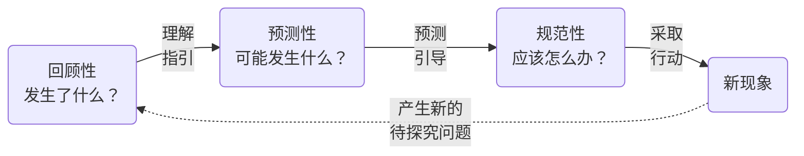
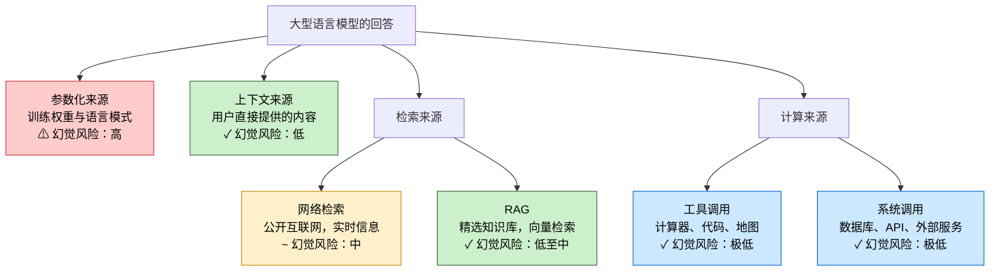
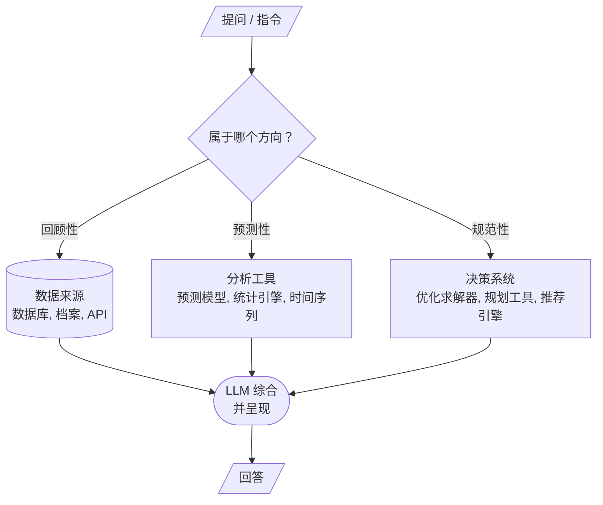
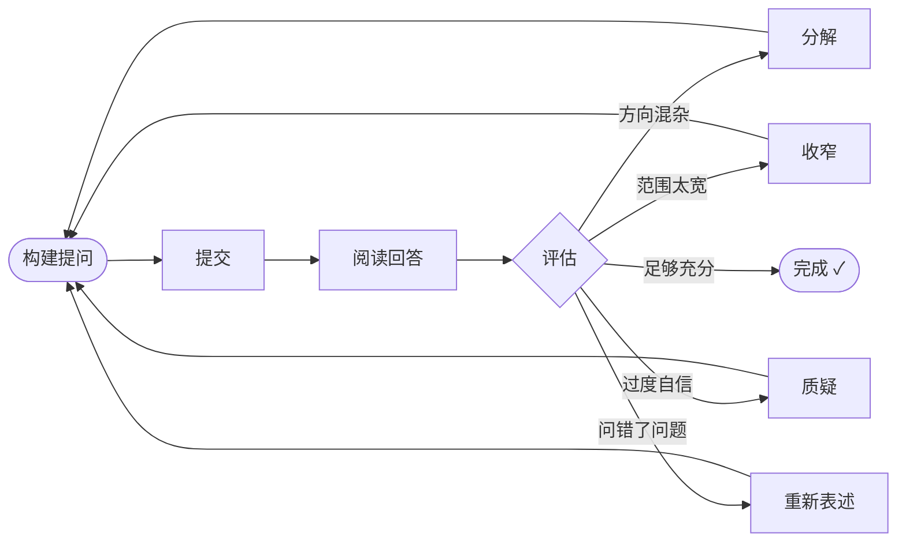

# 如何向大型语言模型提问：从知识、判断到责任的一种思辨

一份关于有效提问原则的教学指南——以及它如何揭示我们思维的本质。

---

## 目录

1. [我们为什么使用大型语言模型](#我们为什么使用大型语言模型)
2. [为什么必须重新学习"提问"](#为什么必须重新学习提问)
3. [三种根本方向](#三种根本方向)
4. [大型语言模型究竟在做什么](#大型语言模型究竟在做什么)
5. [提问不是中性的](#提问不是中性的)
6. [什么是好的提问](#什么是好的提问)
7. [语言质量：语法、语义与表示学习](#语言质量语法语义与表示学习)
8. [幻觉问题：双向的困境](#幻觉问题双向的困境)
9. [负责任地使用](#负责任地使用)
10. [领域工具与路由维度](#领域工具与路由维度)
11. [提问是一个迭代过程](#提问是一个迭代过程)
12. [实际例子](#实际例子)
13. [结语：向模型提问，也是在训练我们自己](#结语向模型提问也是在训练我们自己)

---

## 我们为什么使用大型语言模型

我们之所以使用大型语言模型，是因为它能够**理解和生成自然语言**，从而大幅降低人与计算机交互的门槛。相比传统软件需要结构化输入和固定流程，大型语言模型可以直接处理人类日常语言中的模糊性和复杂性。

这使得它能够胜任广泛的任务：信息查询、内容生成、知识总结以及决策支持。它还能将分散在不同数据源中的信息进行整合，并以连贯、可读的形式呈现出来。

在结合外部工具和领域系统之后，大型语言模型不仅可以"回答问题"，还可以"完成任务"——成为**连接人类意图与复杂系统之间的一种通用接口**。在这个语境下，一条指令（prompt）不再只是搜索词，而是发给一个能够推理、路由和行动的智能体的指令。

这正是提问质量如此重要的原因：这个接口的表达能力足以处理你说出的几乎任何内容，但也正因为这种表达自由，你说了什么、怎么说，决定了后续一切的走向。

---

## 为什么必须重新学习"提问"

今天，越来越多的人开始把大型语言模型当作工作助手、学习助手，甚至某种"超级大脑"。人们希望它帮助自己理解新闻、分析经济、回顾历史、整理观点、生成文字、提出建议。于是，一个看似简单的问题浮现出来：**我们到底应该怎样向它提问？**

表面上看，这只是一个 Prompt Engineering 的问题，似乎只是研究"提示词怎么写得更好"。但如果我们更认真地想一想，就会发现，这并不只是技术问题。**它首先是一个关于语言的问题，一个关于知识的问题，最后也是一个关于责任的问题。**

### 提问是思维方式的投影

因为当人向大型语言模型提问时，他并不是仅仅在输入一串文字，而是**在把自己的意图、假设、立场、知识边界和认知习惯一并交给系统**。一个 prompt，表面上是句子，深层上却是思维方式的投影。我们怎样提问，不只是决定机器怎样回答，也决定我们自己将怎样理解这个世界。

语言模型因此成为一面镜子。它们反映的不是我们问题的对象（即现实本身），而是我们问题的质量。这就是为什么学会好好提问不是可选的修饰——它是一种智识纪律，能够磨锐我们对任何事物的理解，无论是否使用AI。

---

## 三种根本方向

### 人类探究的通用逻辑

人类对复杂系统的探究遵循一种通用逻辑，超越领域边界。无论是调查病人的病情、机器的故障，还是市场的走向，人类都在以同样的顺序问同样的根本问题。

这三个类别不是任意的划分——它们反映的是知识积累和智慧展开的自然进程：

1. **理解**先于**预测**
2. **预测**指引**行动**
3. **行动**创造出新的现象待理解

这三者共同构成一个知识、反思与干预的循环——人类与任何复杂系统深度接触的节律。

这一三分结构，映射着亚里士多德早在人工智能诞生之前就已认识到的洞见：人类的认识方式具有不可化约的多元性。*认识论*（episteme）——理论性或科学性的知识——关乎"是什么"与"为什么"；它是普遍成立、可被论证的知识。*实践智慧*（phronesis）——是在具体情境中辨别"应该做什么"的能力，权衡任何公式都无法完全捕捉的价值与约束。从回顾性探究经由预测走向规范性判断的进程，正是从认识论迈向实践智慧的缩影。伽达默尔将理解描述为一种*诠释学循环*：不理解部分就无法把握整体，不预见整体就无法读懂部分。解释者的视域（horizon）——由先在理解、文化和经验塑造——从未缺席于探究行为之中。下图所示的知识循环，正是诠释学循环的实践形式：每一次理解都移动了我们的视域，开启出此前无法提出的新问题。

好的 prompt，不在于堆砌词语，而在于弄清楚：**自己在这个循环的哪个阶段，在问什么类型的问题**。

### 第一方向：回顾性（已经发生了什么）

*哪些信息相对稳定、可以核实？发生了什么？我们对现状的了解是什么？*

回顾性的视角是关于**建立基础事实**。在我们预测未来或规定行动之前，必须先理解我们对当下和过去的了解。这是所有推理的基础——建立信心所依托的经验基石。回顾性问题问的是："证据告诉了我们什么？"这是一种认识论上的谦逊：承认我们能够核实的内容，并将其与我们必须推断的内容区分开来。

### 第二方向：预测性（未来可能发生什么）

*如果条件继续演进，可能出现哪些不同结果？我们可以向前推断什么模式？*

预测性的视角是通过**有根据的推断**将知识延伸到未来。预测不是要实现确定性——而是量化不确定性、识别轨迹。它反映了人类预判、准备，从被动反应转向主动的愿望。预测性问题承认未来由已观察到的模式塑造；它们是跨越时间延伸的模式识别行为。

### 第三方向：规范性（我们应该怎么办）

*在不同目标和约束下，应该做什么？什么行动是最优的？*

规范性的视角是关于**将知识转化为意志**。这是理解与责任相遇的地方。规范性问题不仅仅问什么是真的或什么会发生——它问的是，鉴于我们的价值观、约束和目标，*应该*发生什么。这是决策、判断和能动性的领域。这些问题承认多种未来都是可能的，而我们的选择决定了哪一种得以实现。

休谟指出了哲学家所称的*实然-应然鸿沟*：任何纯粹描述性的事实链条，本身都无法在逻辑上导出规范性结论。"失业率上升了三个百分点"这一事实，如果没有额外的价值前提，并不能得出"我们应该降息"的结论。这就是为什么把回顾性与规范性分开，不只是一种表达清晰的技巧——而是哲学层面的必要。混淆两者，就是把价值判断偷运进了看似中立的描述之中。

无论模型能力多强，都无法仅从事实推导出你"应该"做什么，而不引入只有你才能提供的价值前提。当模型给出建议时，它有意或无意地引入了某些价值假设。你的任务是使这些假设可见，并判断它们是否是你自己的。

### 为什么分离三个方向如此重要

许多人写 prompt 时，喜欢把大量信息、指令、要求一股脑塞进去，以为越长越好。其实，长度不是问题——**混层才是问题**。

例如，面对政治新闻，通常的诱惑是问：

> "帮我分析一下这个政策到底好不好，会不会失败，老百姓会不会反感，顺便告诉我媒体是不是有偏见。"

这里把事实、解释、预测和价值判断混在了一起。更好的做法是按方向分开来问：

1. **回顾性**：这项政策的主要内容是什么？
2. **解释性**：支持者和反对者分别基于什么理由？
3. **预测性**：短期和长期可能带来哪些不同结果？
4. **规范性**：在什么价值标准下，人们会认为它是成功或失败？

**关键是分离它们**——不是因为语言模型要求，而是因为**你**需要清晰地思考。

---

## 大型语言模型究竟在做什么

语言模型看似在"回答问题"，但不是因为它直接感知现实，也不是因为它固有真理。

它的核心机制：**从文本中学习统计规律，然后预测最可能出现的下一步。**

它本质上是**概率性语言预测系统**——只是次要地表现出理解、解释、推理或创造的假象。

这意味着：
- 模型的答案通常是语言空间中的高概率产物
- 可能有用、流畅、接近现实
- 但并不等同于现实本身

### 为什么这个区分至关重要

这不是一个可以一笔带过的技术细节。它是负责任地使用这些系统的基础。语言模型操作的领域是**可表达的、连贯的、典型的**——而不是**真实的**。这两个领域有重叠，但绝不相同。

理解这个鸿沟至关重要，因为它保护你免于一种隐蔽的智识危险：恰恰因为答案听起来合理就接受它。一个模型的输出越流畅、越有说服力，你的审视就应该越严格。

### 大型语言模型的答案从哪里来

这是理解大型语言模型时一个非常重要的问题。大型语言模型给出的答案，可以来自四种不同的来源——每一种来源的可靠性、时效性和幻觉风险各不相同。

**参数化来源——模型内部已经学到的知识和语言模式。**
模型在训练过程中接触了大量文本，将语言中的模式、关联和常见表达方式"压缩"进参数之中。当我们提问时，它会根据上下文预测"接下来最合理、最可能出现的内容"。

*幻觉风险：**高。*** 模型从统计概率而非经过核实的事实中生成内容。它可能自信地给出错误的姓名、日期、引文或数字——尤其是在知识截止日期附近、涉及冷门话题，或被要求给出精确数字时。这是风险最高的来源，因为没有外部事实来约束输出。*仅依赖参数化知识的大型语言模型，产生幻觉的概率最高。*

**上下文来源——你在提问中直接提供的内容。**
你粘贴进提问的文档、数据、示例或事实。你清楚它们的出处、时效性和准确性——模型也直接拥有这些内容。

*幻觉风险：**低。*** 模型可以锚定在所提供的内容上。它仍可能误读、断章取义，或添加原文中不存在的细节——但有了内容基础，凭空捏造大幅减少。*这就是为什么自己提供来源，是防止幻觉最有效的手段之一。*

**检索来源——从外部获取的信息。**

- *网络检索* ——搜索公开互联网以获取最新信息，适合时效性强的问题：今天的新闻、当前价格、最近的政策变化。

  *幻觉风险：**中。*** 检索到的内容为回答提供了锚点，但模型可能错误引用、张冠李戴，或混淆来源。互联网本身也包含不准确或有偏见的内容。*如果没有网络检索，大型语言模型对于任何知识截止日期之后或实时的信息，产生幻觉的风险极高。*

- *RAG（检索增强生成）* ——在经过精心整理的特定领域语料上进行检索：公司文档、内部知识库、专有数据集、向量索引档案。

  *幻觉风险：**低至中。*** 精选内容大幅降低了风险，但模型仍可能在检索段落实际内容之外进行生成——在"空隙中产生幻觉"。*如果没有RAG，大型语言模型对于训练数据中不存在的专有或领域知识，产生幻觉的风险很高。*

**计算来源——通过调用外部工具或系统产生的结果。**

- *工具调用* ——计算器、代码执行引擎、地图服务、绘图工具。计算本身是确定性的。

  *幻觉风险：**极低**（对于结果本身）。风险在于设置阶段——错误的公式、错误的输入、对问题的误解——发生在调用工具之前。*如果没有工具调用，大型语言模型对于任何精确计算或确定性运算，产生幻觉的风险很高。*

- *系统调用* ——数据库、API、企业系统，用于获取实时运营数据。

  *幻觉风险：**极低**（对于数据检索本身）。实时数据是权威的。风险在于对结果的解读或综合。*如果没有系统访问，大型语言模型根本无法获知任何实时系统或记录的当前状态。*

在这两种计算场景中，模型扮演的都是**"理解问题并将其路由到正确工具"的协调者**——而不是单靠记忆作答的知识库。

### 幻觉风险汇总

| 来源 | 幻觉风险 | 仅靠大型语言模型 |
|---|---|---|
| 参数化来源 | ⚠ 高 | 风险最高——无外部基础 |
| 上下文来源 | ✓ 低 | 低——前提是提供了内容 |
| 网络检索 | ~ 中 | 没有检索则风险极高 |
| RAG | ✓ 低至中 | 没有知识库则风险高 |
| 工具调用 | ✓ 极低 | 精确计算风险高 |
| 系统调用 | ✓ 极低 | 根本无法获取实时数据 |

**从本质上说，答案越依赖参数化知识，幻觉风险就越高。** 最可靠的回答，往往是将上下文基础与正确的检索或计算工具相结合——让模型去做它最擅长的事：理解、综合与解释。

---

## 提问不是中性的

不是所有问题都属于同一类型。同一话题可以在不同层次被提出：

**政治话题中：**
- "这项政策的主要内容是什么？" → 事实性
- "支持者和反对者如何解释它？" → 解释性
- "它可能产生什么影响？" → 预测性
- "应该支持它吗？" → 判断性

**经济话题中：**
- "当前通胀率是多少？" → 事实
- "为什么体感通胀与官方数据有差异？" → 分析
- "会发生衰退吗？" → 预测
- "我应该调整投资策略吗？" → 建议

**历史话题中：**
- "这个事件发生在何时？" → 事实
- "为什么会发生？" → 解释
- "如果历史走向不同会怎样？" → 反事实推测

**一个成熟的提问者首先要知道：自己要的是事实、解释、预测，还是建议。**

### 提问的本体论

提问之所以不是"中立的"，正因为语言本身不是中立的。你提出的每一个问题都包含关于以下的隐含假设：
- 什么算作证据
- 哪些观点是合理的
- 什么边界分隔了不同的话题
- 哪些结果是重要的

政治问题隐含着哲学承诺。经济预测隐含着对理性的假设。历史判断隐含着对人性的价值前提。当你向语言模型提问任何事情时，你都在外包这些假设——通常是在没有意识到的情况下。

路德维希·维特根斯坦曾言：*"我的语言的边界就是我的世界的边界。"* 你的语言所提供的概念范畴，是你能够表达问题的唯一工具。如果你的语言缺乏区分相关与因果、区分时间变化与逻辑蕴含的概念，你便无法就这些区分提问——模型也无法替你发现它们。问题不只是反映思维，而是构成和限定思维。提问质量的上限，终究取决于你概念词汇的质量。

仔细提问的纪律，因此也是一种**让你自己思维中的隐藏内容可见**的纪律。

---

## 什么是好的提问

一条 prompt 不仅仅是一个句子——它是一种结构化的交流行为。理解三种根本方向，给了我们一个框架，用来判断一个构建良好的提问究竟需要包含哪些内容。

### 好的提问的解剖

一条好的 prompt 通常包含：

1. **方向** — 这是回顾性、预测性，还是规范性问题？明确方向影响一切其他选择。
2. **主体** — 正在分析的是什么实体、系统或领域？要具体：不是"经济"，而是"2018—2023年美国制造业就业"。
3. **范围与约束** — 适用哪个时间段、地点、数据集或标准？约束条件缩小了答案空间，并为回答提供了锚点。
4. **目标** — 你是在尝试理解、决策，还是行动？同样的事实，在不同目标下意味着不同的东西。
5. **期望的回答形式** — 好的回答应该是什么样的？列表？概率估计？排名建议？附有来源的摘要？
6. **路由目标**（在适用时）— 哪个系统、数据库或工具最适合提供这个答案？详见领域工具章节。

### 确定性 vs. 开放性

还有一个重要区分：**这个问题是否有唯一正确答案，还是可以有多个有效回答？**

- **确定性提问**有可核实的答案："2022年的GDP增长率是多少？"你可以检验回答是否正确。
- **开放性提问**允许多种有效回答："面对增长放缓，我们应该怎么办？"这里的有效性由推理质量判断，而非事实准确性。

知道你面对的是哪种类型，改变了你评估回答的方式——以及你应该在何处提出质疑。

### 提问方式的差距

| 弱提问 | 强提问 |
|---|---|
| "这个政策公平吗？" | "这项政策在不同收入群体之间是否平等地分配了成本和收益？" |
| "市场会崩溃吗？" | "历史上哪些领先指标通常先于经济衰退出现，目前哪些处于高位？" |
| "我应该怎么办？" | "对于10年投资期限、中等风险承受能力的情况，在高通胀环境下，历史上哪些投资组合调整表现较好？" |

弱的提问并非错误——它们只是欠定。它们把"公平""崩溃""应该"的含义留给模型去猜测。

---

## 语言质量：语法、语义与表示学习

### 语法不是装饰

语法编码关系：

- 谁在做什么
- 哪个条件限制哪个结论
- 什么是因果、转折或假设关系
- 什么是核心，什么只是背景

**当语法不清楚时，模型必须自己补全缺失信息。** 它猜得越多，输出就越可能在语言上合理但与你的本意不符。

这里有一条值得记住的原则：

> **语法决定关系，语义决定边界，结构决定推理路径。**

### 语义精确性

许多词看似人人都懂，但边界其实不清：

- 自由、公平、失败、危机
- 保守、激进、有效、靠谱

这些词含义**高度依赖语境。** 如果问"这个政策公平吗""这个措施有效吗"，模型无法确定你用的标准是什么，只能在多个可能框架中做概率补完。

更好的做法：**把抽象词拆解成可测量的问题。**

与其问：
> 这项政策公平吗？

不如问：
- 它对不同收入群体的影响是否相同？
- 谁承担成本，谁获得收益？
- 它符合法律意义上的平等，还是结果意义上的平等？

### Embedding 与模糊的叠加效应

现代语言模型将词、短语、上下文映射到高维向量空间——一种**从表达在各种语境中出现的方式学到的分布式表示。**

语义相关的表达在表示空间中聚集得更近。但靠近不等于相同。同一个词在不同语境中含义会变化。

**模糊词激活的语义邻域太广。** 当你用"公平""失败""危险"这类词时，模型可能联想到很多相关但不完全一致的语义区域，导致它沿着常见模板展开，而非精准对准你的本意。

Embedding 不会"导致"模糊，但它帮助解释为什么语言精确性会在回答质量上产生叠加效果——语言越精确，回答越可靠。

---

## 幻觉问题：双向的困境

"幻觉"（hallucination）常被理解为模型"瞎编"。

更深层的理解：模型生成的是**在语言上最像答案的内容，而不是必然与现实相符的内容。**

如果你的问题定义不清、证据不足、语义边界模糊，模型就会产生听起来合理但实际不可靠的回答。

**幻觉不只是模型的问题——往往也是提问方式失衡的结果。**

例如：

- 当你要求它"总结今天政治局势的真相"，但又不给出可信来源，问题本身已经含混
- 当你问"某个政客是不是彻底撒谎"，你其实把复杂事实压缩成了道德判决
- 当你问"未来三个月经济一定会崩吗"，你是在要求不确定系统提供确定语气

这种时候，模型即使回答得非常流畅，也可能只是顺着你语言里的暗示，生成一个看似完整的叙述。**真正危险的，并不只是模型会 hallucinate，而是人愿意接受那些迎合自己偏见的 hallucination。**

### 人类共有的脆弱性

幻觉揭示了一个令人不适的真理：**人类和语言模型共享同样的根本脆弱性。** 当我们面对模糊、欠定的问题时，人类也会产生虚构——我们会用文化上典型的、情感上共鸣的、叙事上合理的内容填补空白，通常不意识到自己在这样做。

机器的幻觉更可见、更容易被暴露、更容易被测量。但它本质上与人类在信息不完整时的推理没有根本区别。

这正是为什么学会好好提问，反讽地说，也是学会作为人类更好地思考。

### 洞穴与镜子

柏拉图的洞穴寓言描述了终生只能观看墙上投影的囚徒。从未见过真实物体，他们将阴影当作现实——命名它们、争论它们、发展出关于其行为的精密理论。能够流利地谈论阴影，成了唯一可用的知识标准。

经文本训练的语言模型，在精确意义上是被阴影所训练的：是人类思想的语言表达，而非思想所指向的底层对象。它学到的是观念、事实与论证在语言中呈现的统计形态——这使它在语言表达的"影像世界"中异常流利。当它生成答案时，它产生的是在语言模式空间中*看起来像*可信答案的内容。它并未触及这些模式所指向的底层现实。

危险并不在于模型的欺骗性。而在于这些阴影可以极为生动、内在一致、风格上具有权威感。一个制作精良的幻觉，在认识论上之所以危险，恰恰是因为它看起来不像幻觉。输出的精致，正是让无批判接受如此诱人的原因。

解毒之道，如柏拉图所建议的，是*转向光源*——在经过核实的来源、实际经验和直接证据中寻求基础。上下文锚定、工具调用与检索数据之所以能大幅降低幻觉，正是因为它们将模型的输出重新连接到世界中的对象，而不仅仅是语言影像空间中的模式。

---

## 负责任地使用

善用语言模型，意味着拒绝滥用。

常见的滥用方式：

1. **预设结论，让模型包装** – "请证明这项政策肯定失败"
2. **把宣传伪装成分析** – "经济显然完了，帮我写得更有说服力"
3. **外包判断责任** – "别分析，直接告诉我谁对谁错"
4. **把模型当成最终权威** – 不再查证、比较、区分事实与推测

### 智识诚实的伦理

这些滥用方式有一个共同点：它们都试图**外包责任**。你不再需要承担自己的推理——模型承担。你不再需要接受不确定性——模型给出确定的答案。你不再需要做出判断——模型为你判断。

但这是自我欺骗。模型不能承担责任；只有你才能。当你滥用语言模型时，你不是在欺骗模型——你在欺骗自己，进而也在欺骗那些信任你判断的人。

负责任的使用需要相反的姿态：**通过对自己知道什么、不知道什么、在哪里不确定更诚实地理解，来承担对自己思维更充分的责任。** 语言模型可以是这个项目中的工具——但前提是你拒绝让它成为判断的替代品。

---

## 领域工具与路由维度

### 仅靠模型本身的局限

由于大型语言模型的内部知识存在局限，而互联网信息本身也可能不完整甚至存在偏差，因此仅依赖模型自身生成或简单的网络检索，往往难以保证答案的准确性和可靠性。

在这种情况下，**面向具体领域的工具和应用系统**逐渐成为重要的补充。专业数据库、计算引擎、传感器数据流和应用接口，能够提供：
- **权威数据**：根植于特定领域的真实记录
- **精确计算**：超越统计模式匹配的确定性运算
- **直接访问**：对实时系统和历史档案的精准查询

### 三种方向对应不同的工具

路由维度让三方向框架在操作层面变得有意义，而不仅仅是智识上的整洁：

| 方向 | 需要什么 | 典型工具 |
|---|---|---|
| 回顾性 | 可核实的事实、历史记录 | 数据库、文档存储、传感器档案、API |
| 预测性 | 模式分析、趋势推断 | 预测模型、统计引擎、时间序列工具 |
| 规范性 | 有约束的优化 | 推荐引擎、优化求解器、规划系统 |

在现代具备工具调用和多智能体架构的LLM系统中，一条构建良好的指令不只是在提问——它在**将自身路由到正确的系统**。

关于传感器读数的回顾性查询应该指向数据存储，而不是依赖模型的训练记忆。预测性查询应该调用预测模型。规范性查询应该咨询了解运营约束的系统。

**因此，一个构建良好的提问，不仅仅是结构清晰的语句——它也是指向正确工具的请求。** 知道你需要什么类型的答案，以及谁或什么系统能真正提供它，与知道如何提问同样重要。

---

## 提问是一个迭代过程

好的提问很少是一次性完成的。它是一场**对话**——一系列交流，每一次回答都揭示了模型理解了什么、遗漏了什么，以及下一步应该往哪里推进。

### 读懂第一次回答

第一次回答告诉你的，关于你的提问和关于话题本身一样多：

- 如果回答混合了方向（例如，你问的是事实，它却给了建议），说明你的提问欠定
- 如果回答过于笼统，说明你的范围太宽
- 如果回答对不确定的事情表现出自信，说明你的措辞诱导了过度自信
- 如果回答正是你问的，但不是你需要的，说明你的目标没有说清楚

### 追问的策略

**分解**：如果回答混合了多个方向，把它拆成独立的追问。先问回顾性问题，再问预测性，最后问规范性。

**收窄**：如果回答太宽泛，增加约束。"你描述了一般趋势——现在聚焦在条件Y下的X。"

**质疑**：对有把握的说法提出挑战。"你说了X——证据是什么？"或者"如果相反的情况成立，会改变什么？"

**重新表述**：如果回答答错了问题，重新说明你真正需要的是什么。"我问的不是A，而是在C条件下的B。"

**提升具体性**："给我三个具体例子"或"尽可能量化这个结论"。

### 迭代不是失败

需要多轮交流不是坏提问的标志——它是探究的正常过程。即使是人类专家，在没有来回确认的情况下，也很少能在第一次就正确回答复杂问题。重要的是每次交流都向更精确的方向推进，而不是一次就命中。

**迭代的目标是逐步落地**：每一轮消除一些歧义，确认模型的方向正确，让回答越来越接近你真正需要的内容。

---

## 实际例子

### 政治

**较弱的提问：**
> 这个政策彻底失败了吗？媒体是不是都在带风向？

**更好的提问——按方向分开：**
1. *（回顾性）* 这项政策的主要内容是什么？有哪些执行记录？
2. *（解释性）* 支持者和反对者的核心理由是什么？各自引用了哪些证据？
3. *（预测性）* 在不同条件下，未来两年可能出现哪些不同结果？
4. *（规范性）* 按财政效率、社会公平、法律可行性等不同标准，它会如何被评价？

### 经济

**较弱的提问：**
> 经济这么差，我是不是应该马上卖掉所有股票？

**更好的提问——按方向分开：**
1. *（回顾性）* 目前哪些指标显示经济放缓？这些指标是一致还是矛盾？
2. *（预测性）* 历史上类似条件下，市场出现过哪些不同结果？
3. *（规范性）* 对于不同风险承受能力和投资期限，历史上哪些调整是有据可查的？

### 历史

**较弱的提问：**
> 这个历史人物到底是好人还是坏人？

**更好的提问——按方向分开：**
1. *（回顾性）* 关于这个人物，哪些事实在历史学家之间相对无争议？
2. *（解释性）* 不同历史解释之间的分歧在哪里？各自依据什么史料？
3. *（规范性）* 各种解释背后的价值前提是什么？为什么现代判断标准与当时不同？

---

## 结语：向模型提问，也是在训练我们自己

从更深的意义上说，学习如何使用大型语言模型，不只是学习一种新技术，而是在重新学习如何提问、如何表达、如何思考。

一个成熟的提问者，至少应该知道：

- 我现在要的是事实，还是解释，还是建议？
- 这个问题有没有可靠来源可依？
- 这个问题本身是不是带着我自己的偏见？
- 我是否把多个方向的问题混在了一起？
- 我的语言是否足够清楚，让另一个智能体真正理解我的意思？
- 我是否准备好迭代追问——而不是接受第一个听上去顺耳的答案？

**语言模型不是神谕、不是裁判、也不是替代思考的捷径。**

把它想象成一面由语言和概率构成的镜子。你怎样提问，它就怎样反射。你怎样组织语言，它就怎样组织回答。你怎样处理事实、立场与理性的关系，它就怎样把这些关系放大出来。

与追问纪律关联最深的哲学家是苏格拉底，他自称只知道自己的无知。他的方法——*elenchos*，即反诘——并非旨在提供答案，而是揭示对话者信念中的隐藏结构，以及这些信念在追问下如何瓦解。苏格拉底的洞见是：真正的理解无法被简单地传递；它必须通过诚实探究的纪律，从内部唤醒。善用语言模型，可以扮演这种角色的近似：不是提供真理，而是显现出你实际思考的形状，暴露出裂缝所在。这正是为什么学会好好提问，归根结底，是一种苏格拉底式传统的实践：不是问如何从外部权威那里获取答案，而是学会审问自己的问题，直到它们值得被回答。

**真正高水平的提问工程，不是让机器更像人，而是让人自己变得更有条理、更诚实、更克制。**

所以，真正重要的，也许并不是"怎样让 AI 听懂我"，而是：

> **我是否先把自己的问题想明白了。**
