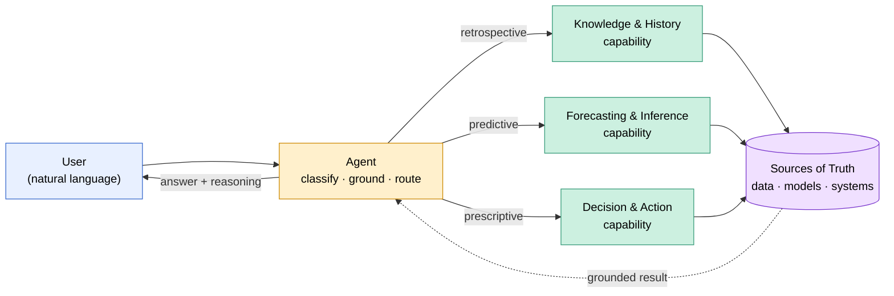
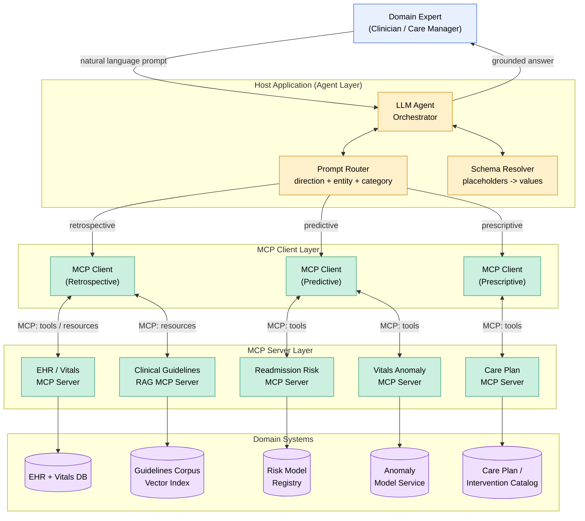
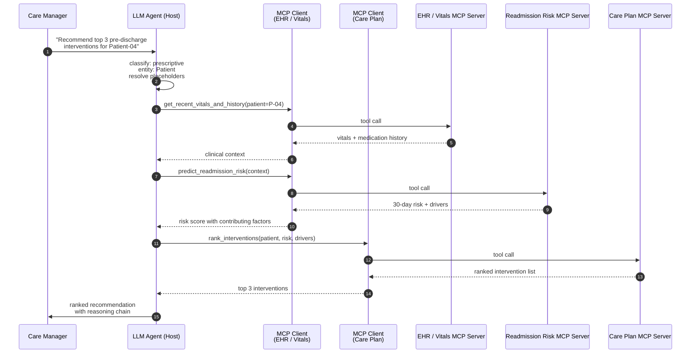

# Prompting in the Enterprise: A Domain Application Guide

A practical guide for applying prompting principles to corporate domains—where prompts become structured artifacts, domain knowledge becomes routable intent, and answers must withstand operational scrutiny.

> **Companion documents:**
> - [prompting-philosophy.md](prompting-philosophy.md) — the conceptual foundation: why prompting matters, where answers come from, and the three directions of inquiry
> - [prompting-guide.md](prompting-guide.md) — the practical quick-start

This guide bridges the two: it takes the philosophy of inquiry and operationalizes it for domains where prompts and queries must be classified, validated, and routed across real systems through an agentic MCP architecture.

---

## Contents

1. [Why Domains Need a Different Discipline](#why-domains-need-a-different-discipline)
2. [The Three Directions, Applied](#the-three-directions-applied)
3. [Where Answers Come From in Production Systems](#where-answers-come-from-in-production-systems)
4. [Agentic Architecture with MCP Servers and Clients](#agentic-architecture-with-mcp-servers-and-clients)
5. [Domain Abstraction: A Lingua Franca](#domain-abstraction-a-lingua-franca)
6. [The Prompt as a Structured Artifact](#the-prompt-as-a-structured-artifact)
7. [Categories of Cognitive Operations](#categories-of-cognitive-operations)
8. [Deterministic vs. Non-Deterministic Prompts](#deterministic-vs-non-deterministic-prompts)
9. [Templates for Domain-Agnostic Reuse](#templates-for-domain-agnostic-reuse)
10. [Building Prompt Sets with SMEs](#building-prompt-sets-with-smes)
11. [Coverage and Completeness](#coverage-and-completeness)
12. [Validation Checklist](#validation-checklist)
13. [Worked Example: From Question to Production](#worked-example-from-question-to-production)
14. [Conclusion: Domain Wisdom as a System Property](#conclusion-domain-wisdom-as-a-system-property)

---

## Why Domains Need a Different Discipline

The philosophy document argues that prompting is a projection of thought—how we ask shapes what we learn. That is true for individuals.

In corporate domains, prompting becomes something more: **a contract between intent and infrastructure.** A care manager asking "Should I prioritize Patient-04 for a follow-up call before discharge?" is not just thinking aloud—she is invoking a chain of EHR retrieval, vitals analysis, risk inference, intervention catalog lookup, and prescriptive recommendation. Each link must work, route correctly, and return a verifiable answer.

This means enterprise prompting carries additional burdens that personal prompting does not:

- **Reproducibility** — Two clinicians asking the same question must get comparable answers
- **Auditability** — When a recommendation drives a clinical intervention, the basis must be traceable
- **Routing** — The right prompt must reach the right system (EHR vs. risk model vs. care plan service)
- **Coverage** — A domain has known operational scenarios; the prompt set must address them

The philosophy in [prompting-philosophy.md](prompting-philosophy.md) tells us *how to think well*. This guide tells us *how to encode that thinking* so it survives the journey from a question to a production response.

---

## The Three Directions, Applied

The philosophy document identifies three universal directions of inquiry: **retrospective, predictive, prescriptive**. In a domain context, these are not just modes of thought—they are routing labels and validation criteria.

### Retrospective — Establishing Ground Truth

*What happened? What is currently the case? What does the record show?*

In the enterprise, retrospective prompts hit **systems of record**: telemetry stores, transaction logs, asset registries, knowledge bases.

| Domain | Retrospective Examples |
|---|---|
| Manufacturing | "What production lines are operational?" / "List all quality defects from last shift." |
| Energy | "What substations are in the network?" / "Retrieve all outage events from last month." |
| Healthcare | "What is the patient's medical history?" / "List all lab results from the past year." |
| Finance | "What were the transaction volumes last quarter?" / "Retrieve all trades for account XYZ." |

**Validation criterion:** The answer can be checked against the source of record. Right or wrong is decidable.

### Predictive — Informed Inference

*What is likely to happen next, if conditions continue?*

Predictive prompts invoke **forecasting models, risk estimators, anomaly detectors**. The output is probabilistic—a distribution, a likelihood, a confidence band.

| Domain | Predictive Examples |
|---|---|
| Manufacturing | "Predict production line downtime risk." / "Forecast product quality metrics for next batch." |
| Energy | "Forecast power demand for next week." / "Predict transformer failure probability." |
| Healthcare | "What is the patient's readmission risk?" / "Predict disease progression over the next 6 months." |
| Finance | "Forecast stock price for next quarter." / "Estimate default probability for this loan." |

**Validation criterion:** Calibration over time. A model that says "20% chance" should be right 20% of the time across many such predictions.

### Prescriptive — Translating Knowledge into Action

*What should be done, given goals and constraints?*

Prescriptive prompts are where models meet **values and accountability**. They invoke optimizers, recommenders, decision-support systems—but the value premises must come from the human.

| Domain | Prescriptive Examples |
|---|---|
| Manufacturing | "Recommend corrective actions for quality issue." / "Prioritize production orders for next shift." |
| Energy | "Optimize load balancing strategy." / "Recommend preventive maintenance for grid equipment." |
| Healthcare | "Recommend treatment plan for this diagnosis." / "Prioritize patients for ICU admission." |
| Finance | "Suggest portfolio rebalancing strategy." / "Recommend fraud prevention actions." |

**Validation criterion:** Multi-faceted. Did the recommendation satisfy the constraints? Did following it produce the desired outcome? Is the reasoning auditable?

### Why Separation Matters in the Enterprise

The philosophy doc warns against mixing directions in personal prompting. In the enterprise, mixing directions is worse—it **breaks routing**. A prompt that asks "What's going on with Patient-04 and what should I do?" combines a retrospective query, an inference, and a prescription. Each maps to a different agent or service. Untangling them is the work of prompt design, not the runtime.

---

## Where Answers Come From in Production Systems

The philosophy doc enumerates four answer sources—**parametric, contextual, retrieved, computed**—each with different hallucination risk. In a corporate domain, these map onto your system architecture:

| Source | Enterprise Equivalent | Hallucination Risk |
|---|---|---|
| Parametric | LLM's pretraining (no domain grounding) | High |
| Contextual | Document content provided in-prompt | Low |
| Retrieved (RAG) | Internal knowledge base, SOPs, manuals | Low–Medium |
| Retrieved (Web) | Open internet (rarely trusted in enterprise) | Medium |
| Computed (Tool) | Calculators, code execution, simulation | Very Low |
| Computed (System) | Telemetry DBs, ERP, work-order systems, APIs | Very Low |

**Implication for prompt design:** Every prompt should be designed with an expected answer source in mind. If the answer should come from a system call, the prompt must carry enough specificity (entity ID, time range, metric) for the call to execute. If the answer is from RAG, the prompt must align with terminology used in the indexed corpus.

> **A well-formed enterprise prompt is one where the routing is unambiguous and the answer source is appropriate to the question type.**

This is why the `type` field (which agent, MCP server, or service handles the request) is non-negotiable in enterprise prompt schemas.

---

## Agentic Architecture with MCP Servers and Clients

Enterprise prompting only works when the agent layer can reliably translate natural-language intent into the right capability call. Before looking at a specific protocol, it helps to see the generic pattern that any agentic system must implement.

### Generic Agentic Flow (Protocol-Agnostic)

At the highest level, every agentic prompting system has the same shape: a user expresses intent in natural language; an agent classifies that intent, grounds it with context, dispatches it to one or more capabilities, and synthesizes a grounded answer. This pattern is independent of any specific protocol.



**Key ideas this diagram captures—true regardless of protocol:**

- The agent does not *know* the answer; it **routes** the question to the right capability
- Capabilities map onto the three directions of inquiry from the philosophy doc
- All capabilities ultimately ground in some authoritative source of truth (database, model, system of record)
- The agent's job is to compose answers from grounded inputs, not to invent them

The Model Context Protocol (MCP) is one—increasingly standard—way to implement this pattern with typed, decoupled capabilities. The next two diagrams show how the generic pattern above maps onto an MCP-based system.

### MCP Component View

The diagram below shows how a domain prompt traverses the stack: a user's natural-language question reaches the LLM agent, which routes it through MCP clients to the appropriate MCP servers, each wrapping a specific domain system.



**How to read it:**
- The **host** holds the LLM agent plus the routing and schema-resolution logic that maps a structured prompt to a capability call.
- The **MCP client layer** is logical: a single host typically multiplexes one client per connected server. Grouping clients by direction (retrospective / predictive / prescriptive) here mirrors the three directions of inquiry.
- The **MCP server layer** exposes typed capabilities. Each server wraps one domain system and translates between MCP requests and that system's native API.
- The **domain systems** are the authoritative sources of truth—EHR records, vitals streams, clinical guideline corpora, risk model registries, and care-plan catalogs.

### MCP Sequence View

A single prescriptive prompt typically requires a chain of calls across multiple MCP servers. The diagram below traces the "When deterioration risk is detected for Patient-04, recommend top three pre-discharge interventions" example.



The agent does not "know" the answer—it **orchestrates** the question across capabilities, each grounded in a domain system. This is the architectural expression of the philosophy doc's principle: *the most reliable answers combine contextual grounding with the right retrieval or computation tool.*

### Why MCP Matters for Enterprise Prompting

Three properties make MCP a fit for the prompt-as-artifact discipline:

1. **Typed capabilities** — Each MCP server publishes a schema for its tools, resources, and prompts. This means a prompt's `type` field is not a label; it is a contract that can be validated at design time and enforced at runtime.
2. **Decoupled lifecycle** — Domain systems evolve independently of the agent. Adding a new forecasting model means adding or updating an MCP server, not retraining the LLM.
3. **Auditable invocation** — Every tool call traverses the MCP boundary, making the chain of evidence (which system was queried, with what arguments, returning what data) recoverable for audit.

> **In an MCP-based agentic system, the prompt schema and the server schema must be co-designed.** The `type` field on a prompt names a server; the server's tool list constrains what that prompt can do; the `characteristic_form` describes what the server is expected to return.

---

## Domain Abstraction: A Lingua Franca

Beneath the surface diversity of domains lies a shared conceptual vocabulary. An equipment failure mirrors a disease progression; a financial transaction parallels a supply chain event. The abstraction does not erase domain knowledge—it creates a **lingua franca** through which it can be expressed, exchanged, and reused.

### Core Placeholders

| Placeholder | Description | Cross-Domain Examples |
|---|---|---|
| `{ENTITY}` | Primary object of analysis | Patient, Account, Equipment, Vehicle, Student |
| `{ENTITY_CLASS}` | Category or type | Diagnosis, Portfolio, HVAC, Fleet, Course |
| `{LOCATION}` | Physical or logical location | Hospital, Branch, Site, Route, Campus |
| `{METRIC}` | Measurement or KPI | Heart Rate, Balance, Temperature, Speed, Grade |
| `{EVENT_TYPE}` | Type of occurrence | Admission, Transaction, Alert, Delay, Enrollment |
| `{EVENT_NAME}` | Specific event label | Readmission, Withdrawal, Failure, Accident, Dropout |
| `{TIME_RANGE}` | Temporal scope | "Last month", "2020-06-01 to 2020-06-30" |
| `{WINDOW}` | Time horizon | "Within 14 days", "Next maintenance window" |
| `{ACTION}` | Intervention or decision | Treatment, Investment, Maintenance, Reroute, Tutoring |
| `{CONDITION}` | Trigger or state | "When anomaly detected", "If balance < threshold" |
| `{OUTPUT_FORM}` | Response format | List, Table, Chart, File, Summary |

### Adapting a Generic Template

**Generic:**
> "Retrieve {METRIC} for {ENTITY} at {LOCATION} over {TIME_RANGE}"

**Domain adaptations:**
- Healthcare: "Retrieve blood pressure for Patient-123 at Boston General over last month"
- Finance: "Retrieve transaction volume for Account-456 at NYC Branch over Q1 2024"
- Manufacturing: "Retrieve cycle time for Robot-5 at Assembly Line A over last week"
- Education: "Retrieve attendance for Student-789 at Main Campus over last semester"

The template is reusable; the domain knowledge fills in the slots; the schema resolver in the host application performs the substitution before dispatching to the MCP layer.

---

## The Prompt as a Structured Artifact

In personal prompting, a prompt is a string. In an enterprise system, it is a **structured object** with metadata that enables routing, validation, and lifecycle management.

### Required Schema

| Field | Type | Purpose |
|---|---|---|
| `id` | integer | Unique identifier |
| `text` | string | The natural-language prompt |
| `type` | string | The agent / MCP server / service that handles the request |
| `category` | string | Cognitive operation type (see next section) |
| `deterministic` | boolean | Whether there is a single correct answer |
| `characteristic_form` | string | Expected response shape and validation criteria |
| `group` | string or array | Direction: retrospective / predictive / prescriptive |
| `entity` | string or array | The physical subject(s) of the query |
| `note` | string | Source, owner, design rationale, dependencies |

### Example: Retrospective

```json
{
  "id": 1,
  "text": "What IoT sites are available?",
  "type": "IoT",
  "category": "Knowledge Query",
  "deterministic": true,
  "characteristic_form": "Returns the list of all sites, as text or as a file reference",
  "group": "retrospective",
  "entity": "Site",
  "note": "Source: Initial domain analysis; Owner: Domain SME team"
}
```

### Example: Prescriptive

```json
{
  "id": 416,
  "text": "When deterioration risk is detected for Patient-04, can you recommend the top three pre-discharge interventions?",
  "type": "CarePlan",
  "category": "Decision Support",
  "deterministic": false,
  "characteristic_form": "Returns a list of interventions, each with a primary clinical rationale and supporting guideline reference",
  "group": "prescriptive",
  "entity": "Patient",
  "note": "Source: Care management team request; supports proactive readmission-prevention workflow"
}
```

### Example: Multi-Group

```json
{
  "id": 420,
  "text": "Review the vitals trends for Patient-04 over June 2024 and flag any anomalies or out-of-range readings as alerts.",
  "type": "VitalsMonitor",
  "category": "Decision Support",
  "deterministic": false,
  "characteristic_form": "Reviews clinical performance and detects anomalies for Patient-04 during June 2024",
  "group": ["retrospective", "predictive"],
  "entity": "Patient",
  "note": "Multi-category query combining historical review with anomaly detection"
}
```

The `note` field is intentionally flexible: it captures provenance, ownership, design intent, and any context that helps a future maintainer understand why this prompt exists.

> **Note on `type`:** In an MCP-based system, the `type` field should resolve to a registered MCP server name (e.g., `EHR`, `RiskModel`, `CarePlan`). Misalignment between `type` and any deployed MCP server is a design defect—the prompt cannot be served.

---

## Categories of Cognitive Operations

The three directions (retrospective, predictive, prescriptive) describe the *purpose* of an inquiry. Categories describe the *cognitive operation* it performs. A single direction can be served by several categories.

| Category | Pattern | Typical Direction |
|---|---|---|
| **Information Retrieval** | "What is...", "List all...", "Show me..." | Retrospective |
| **Data Extraction** | "Download...", "Export...", "Get data for..." | Retrospective |
| **Analysis & Inference** | "Analyze...", "Identify patterns in..." | Retrospective / Predictive |
| **Model Customization** | "Fine-tune...", "Train model on..." | (cross-cutting) |
| **Anomaly & Exception Detection** | "Detect anomalies in...", "Find outliers..." | Predictive |
| **Future State Prediction** | "Forecast...", "Predict probability of..." | Predictive |
| **Recommendation & Optimization** | "Recommend...", "What should I do when..." | Prescriptive |
| **Multi-Step Orchestration** | "Retrieve X, analyze Y, recommend Z" | Cross-direction |

Categories are not mutually exclusive. When a prompt spans several, choose the **primary** category that captures the dominant intent—and capture the rest in `note` or the multi-group field.

---

## Deterministic vs. Non-Deterministic Prompts

This distinction reflects a foundational divide in how we validate answers.

### Deterministic (`deterministic: true`)
- Single, verifiable correct answer
- Response is checkable against ground truth
- Typical for retrieval and well-defined computation
- Validation: exact match or constrained match against source of record

### Non-Deterministic (`deterministic: false`)
- Multiple valid answers possible
- Response quality depends on reasoning, judgment, or domain heuristics
- Typical for recommendations, predictions, complex analysis
- Validation: rubric-based, expert review, outcome tracking

A retrieval question ("What was the temperature reading on 2024-06-12 at 14:00?") is deterministic. A prescriptive question ("What should we do about declining efficiency?") is not. Mark the field correctly—it determines how the response will be evaluated downstream.

---

## Templates for Domain-Agnostic Reuse

These templates are domain-neutral and can be adapted by filling in placeholders.

### Template 1: Historical Data Retrieval (Retrospective)
```
Retrieve {METRIC} for {ENTITY} at {LOCATION} from {TIME_RANGE}
```

### Template 2: Knowledge Lookup (Retrospective)
```
List all {ATTRIBUTE} of {ENTITY_CLASS}
```

### Template 3: Predictive Analysis (Predictive)
```
Forecast {METRIC} for {ENTITY} for {FUTURE_RANGE} based on data from {PAST_RANGE}
```

### Template 4: Anomaly Detection (Predictive)
```
Is there any anomaly detected in {ENTITY}'s {METRIC} in {TIME_RANGE} at {LOCATION}?
```

### Template 5: Recommendation (Prescriptive)
```
When {CONDITION} happens for {ENTITY}, recommend {ACTION_TYPE}
```

### Template 6: Multi-Factor Decision Support (Cross-direction)
```
Review {DATA_SOURCES} for {ENTITY} during {PERIOD} and {recommend/analyze/prioritize} {ACTION}
```

---

## Building Prompt Sets with SMEs

Domain expertise is distributed across people, not concentrated in any one expert. Prompt set construction should reflect this reality.

### Suggested Workflow

1. **Divide by expertise** — Different SMEs contribute prompts for their areas of depth (equipment types, operational functions, problem categories)
2. **Start small** — 5–10 critical, high-frequency queries per SME initially
3. **Iterate** — Add edge cases, test with users, refine based on feedback
4. **Vary specificity** — Mix generic templates (reusable), domain-specific prompts (tailored), and scenario-specific queries (deep expertise)

### Prioritization Heuristic

Focus first on intersections of:
- **High frequency** — common operational queries
- **High impact** — queries that drive significant decisions or spend
- **Available data** — scenarios where the underlying data exists today and an MCP server can serve it

Avoid the temptation to enumerate exhaustively up front. Coverage emerges through use.

---

## Coverage and Completeness

Completeness is not a count; it is **sufficient coverage of fundamental patterns** in the domain. Track it across several dimensions.

### Operational Lifecycle Coverage
- Normal operations monitoring
- Degradation detection and tracking
- Event prediction and diagnosis
- Action planning and execution
- Performance optimization
- Compliance and reporting

### Direction Balance
- Retrospective queries
- Predictive queries
- Prescriptive queries

A heavily retrospective set (typical for early-stage deployments) is fine—but recognize the imbalance and plan to extend.

### Entity / System Coverage
- All critical entity types in the domain
- Key subsystems and components
- Cross-entity dependencies and interactions

### MCP Capability Coverage
- Every prompt's `type` resolves to a deployed MCP server
- Every MCP server has at least one prompt that exercises each of its tools
- Multi-server orchestration prompts are explicitly tested

### Stakeholder Perspective Coverage
- Operations team needs
- Management team needs
- Engineering / analysis team needs
- End-user needs

A coverage matrix mapping these dimensions against your existing prompt set will surface gaps quickly.

---

## Validation Checklist

Before promoting a prompt to a production set, verify:

- [ ] **Clarity** — Is the request unambiguous?
- [ ] **Completeness** — Are all necessary parameters specified?
- [ ] **Direction** — Is the `group` field (retrospective / predictive / prescriptive) correct?
- [ ] **Category** — Is the cognitive operation type correctly assigned?
- [ ] **Deterministic Flag** — Set accurately based on answer uniqueness?
- [ ] **Characteristic Form** — Clearly describes expected output and validation criteria?
- [ ] **Routing** — Does `type` resolve to a registered MCP server with the required capability?
- [ ] **Domain Relevance** — Does it map to a real operational need?
- [ ] **Testability** — Can the response be validated or evaluated?
- [ ] **Consistency** — Follows established patterns and terminology?
- [ ] **Domain-Neutrality** — Can it be adapted via placeholders to other domains?
- [ ] **SME Validation** — Has a domain expert reviewed and approved it?
- [ ] **Coverage Contribution** — Does it fill a gap in the coverage matrix?

---

## Worked Example: From Question to Production

**Initial vague question (from a care manager):**
> "Is Patient-04 going to be readmitted soon, and what should I do about it?"

**Problems:**
- Mixes predictive ("going to be readmitted") and prescriptive ("what should I do") directions
- "Soon" is undefined (7 days? 30 days? same admission cycle?)
- "Readmitted" is undefined (any readmission? unplanned only? for the same condition?)
- "What should I do" hides value premises (cost-minimizing? patient-preference-respecting? guideline-adherent?)
- Routing is ambiguous—no single MCP server can answer the whole thing

**Refined into a structured set:**

```json
[
  {
    "id": 501,
    "text": "Retrieve recent vitals, lab results, and medication history for Patient-04 over the past 30 days.",
    "type": "EHR",
    "category": "Data Extraction",
    "deterministic": true,
    "characteristic_form": "Structured clinical record covering vitals, labs, and active medications for the requested window",
    "group": "retrospective",
    "entity": "Patient",
    "note": "Routes to EHR MCP server; first step in readmission-risk workflow"
  },
  {
    "id": 502,
    "text": "Predict the probability of unplanned readmission for Patient-04 within the next 30 days.",
    "type": "RiskModel",
    "category": "Future State Prediction",
    "deterministic": false,
    "characteristic_form": "Probability with confidence interval; cite top contributing risk drivers",
    "group": "predictive",
    "entity": "Patient",
    "note": "Routes to Readmission Risk MCP server; defines 'soon' as 30-day window and 'readmission' as unplanned all-cause"
  },
  {
    "id": 503,
    "text": "If readmission probability for Patient-04 exceeds threshold, recommend top three pre-discharge interventions.",
    "type": "CarePlan",
    "category": "Recommendation & Optimization",
    "deterministic": false,
    "characteristic_form": "Ranked list of interventions with primary clinical rationale, supporting guideline reference, and expected risk reduction",
    "group": "prescriptive",
    "entity": "Patient",
    "note": "Routes to Care Plan MCP server; threshold and value premises (cost vs. outcome vs. patient preference) defined by clinical governance policy"
  }
]
```

The original ambiguous question becomes three structured prompts—each with a clear direction, a routable MCP server, and a verifiable response shape. The host agent orchestrates the chain: prompt 501 grounds the context, 502 produces the prediction, 503 turns it into action. Note that the prescriptive prompt explicitly defers value premises (which trade-offs to weigh) to clinical governance—the model recommends, but the framework for *what counts as a good recommendation* is supplied by humans. This is what enterprise prompt engineering looks like in practice.

---

## Conclusion: Domain Wisdom as a System Property

The philosophy doc argues that prompting is self-discipline—learning to ask well sharpens how you think. In the enterprise, that discipline scales: **a well-designed prompt set encodes the collective intelligence of an organization** about how its domain should be queried, reasoned about, and acted upon.

The three directions (retrospective, predictive, prescriptive) tell you what kind of question you are asking. The placeholders tell you how to express it. The schema tells you how to make it operational. The categories tell you what cognitive work is being done. The MCP architecture tells you how it gets answered. The validation checklist tells you when it is ready to ship.

None of this replaces the philosophy. It encodes it.

When done well, an enterprise prompt set becomes a living artifact—a shared vocabulary that lets domain experts, engineers, and AI agents communicate without losing precision. It is the corporate analogue of clear individual prompting: not a way to make the machine smarter, but a way to make the organization more **precise, more disciplined, and more honest about what it knows and what it does not.**

---

## See Also

- [prompting-philosophy.md](prompting-philosophy.md) — the conceptual foundation
- [prompting-guide.md](prompting-guide.md) — the practical quick-start
- [temp/utterance_design_guideline.md](temp/utterance_design_guideline.md) — the source guideline this document builds on
- [temp/case_study_industrial_asset_management.md](temp/case_study_industrial_asset_management.md) — extended case study (152 prompts, real-world growth)
- [temp/case_study_wind_turbine.md](temp/case_study_wind_turbine.md) — extended case study (30 prompts, balanced design)
